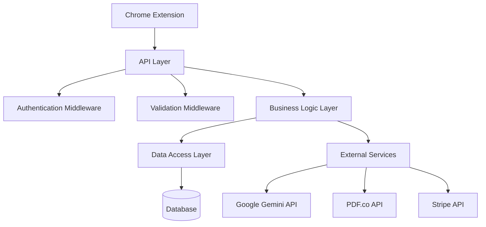

# Design Document

## Overview

This design transforms the Resume Tailor backend from a prototype with mock data into a production-ready API server. The solution addresses critical functionality gaps, security vulnerabilities, and architectural issues while maintaining compatibility with the existing Chrome extension interface.

The design follows a layered architecture with proper separation of concerns: API layer, business logic layer, data access layer, and external service integration layer. This approach ensures maintainability, testability, and scalability.

## Architecture

### System Architecture



### Database Architecture

The system will use PostgreSQL with the following schema:

```sql
-- Users table for authentication and token management
CREATE TABLE users (
    id UUID PRIMARY KEY DEFAULT gen_random_uuid(),
    email VARCHAR(255) UNIQUE NOT NULL,
    password_hash VARCHAR(255) NOT NULL,
    tokens INTEGER DEFAULT 5,
    stripe_customer_id VARCHAR(255),
    created_at TIMESTAMP DEFAULT NOW(),
    updated_at TIMESTAMP DEFAULT NOW()
);

-- Generation history for tracking and analytics
CREATE TABLE generations (
    id UUID PRIMARY KEY DEFAULT gen_random_uuid(),
    user_id UUID REFERENCES users(id),
    job_description TEXT NOT NULL,
    original_filename VARCHAR(255),
    status VARCHAR(50) DEFAULT 'completed',
    created_at TIMESTAMP DEFAULT NOW()
);

-- API usage tracking
CREATE TABLE api_usage (
    id UUID PRIMARY KEY DEFAULT gen_random_uuid(),
    user_id UUID REFERENCES users(id),
    endpoint VARCHAR(100) NOT NULL,
    tokens_used INTEGER DEFAULT 1,
    created_at TIMESTAMP DEFAULT NOW()
);
```

## Components and Interfaces

### 1. Authentication System

**JWT Authentication Middleware**

- Validates JWT tokens from Authorization header
- Extracts user information for request context
- Handles token expiration and refresh logic

**User Management Service**

- User registration and login endpoints
- Password hashing using bcrypt
- JWT token generation and validation

### 2. Document Processing Pipeline

**File Upload Handler**

- Multer configuration for memory storage
- File type validation (PDF, DOCX, TXT)
- File size limits and security checks

**Document Parser Service**

- Primary: PDF.js-extract for PDF parsing
- Fallback: PDF.co API for complex PDFs
- DOCX parsing using docx library
- Text extraction and cleaning utilities

### 3. AI Content Generation

**Gemini Integration Service**

- Structured prompts for resume tailoring
- JSON response parsing and validation
- Error handling for API failures
- Rate limiting for API calls

**Content Formatter**

- Resume section identification
- Professional formatting rules
- Cover letter template generation

### 4. Document Generation

**DOCX Generator**

- Professional resume templates
- Section-based formatting (headers, bullets, spacing)
- Cover letter formatting with proper business structure

**PDF Generator**

- Font embedding and styling
- Multi-page support with proper pagination
- Professional layout with consistent spacing

### 5. Payment Processing

**Stripe Integration**

- Secure checkout session creation
- Webhook signature verification
- Atomic token balance updates
- Payment failure handling

### 6. Database Layer

**Connection Management**

- PostgreSQL connection pooling
- Transaction support for atomic operations
- Connection retry logic and error handling

**Repository Pattern**

- UserRepository for user operations
- GenerationRepository for tracking
- Proper SQL injection prevention

## Data Models

### User Model

```javascript
{
  id: UUID,
  email: string,
  passwordHash: string,
  tokens: number,
  stripeCustomerId: string,
  createdAt: Date,
  updatedAt: Date
}
```

### Generation Request Model

```javascript
{
  userId: UUID,
  jobDescription: string,
  resumeFile: Buffer,
  profileFile?: Buffer,
  options: {
    format: ['docx', 'pdf'],
    includeProfile: boolean
  }
}
```

### AI Response Model

```javascript
{
  tailoredResume: string,
  coverLetter: string,
  metadata: {
    processingTime: number,
    tokensUsed: number
  }
}
```

## Error Handling

### Error Classification

1. **Validation Errors (400)** - Invalid input parameters
2. **Authentication Errors (401)** - Invalid or missing tokens
3. **Authorization Errors (403)** - Insufficient permissions/tokens
4. **Not Found Errors (404)** - Resource not found
5. **Rate Limit Errors (429)** - Too many requests
6. **Server Errors (500)** - Internal processing failures

### Error Response Format

```javascript
{
  error: {
    code: string,
    message: string,
    details?: object,
    timestamp: string
  }
}
```

### Logging Strategy

- Structured logging using Winston
- Different log levels for different environments
- Error tracking with stack traces
- Request/response logging for debugging

## Testing Strategy

### Unit Testing

- Service layer testing with mocked dependencies
- Database repository testing with test database
- Utility function testing for document processing

### Integration Testing

- API endpoint testing with supertest
- Database integration testing
- External service integration testing with mocks

### End-to-End Testing

- Complete workflow testing from file upload to document generation
- Payment processing testing with Stripe test mode
- Chrome extension compatibility testing

### Performance Testing

- Load testing for concurrent document generation
- Memory usage testing for large file processing
- API response time benchmarking

## Security Considerations

### Input Validation

- File type and size validation
- SQL injection prevention
- XSS protection for text content
- Rate limiting per user and IP

### Authentication Security

- JWT token expiration and rotation
- Password strength requirements
- Secure password hashing with bcrypt
- Session management

### API Security

- CORS configuration for Chrome extension
- API key protection in environment variables
- Request signing for sensitive operations
- HTTPS enforcement in production

### Data Protection

- Database encryption at rest
- Secure file handling and cleanup
- PII data handling compliance
- Audit logging for sensitive operations

## Performance Optimizations

### Caching Strategy

- Redis caching for frequently accessed user data
- Document template caching
- API response caching where appropriate

### Resource Management

- File cleanup after processing
- Memory management for large documents
- Connection pooling for database and external APIs
- Async processing for non-blocking operations

### Scalability Considerations

- Horizontal scaling support
- Load balancer compatibility
- Database read replicas for scaling
- Queue system for background processing
