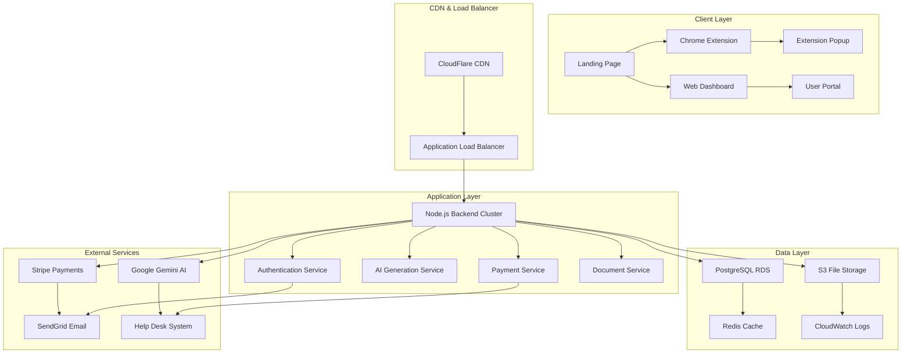
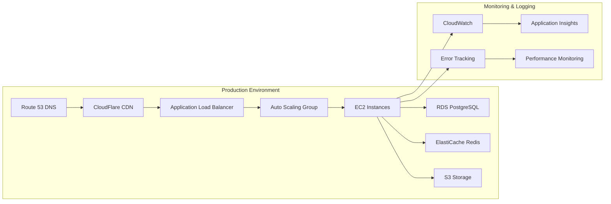
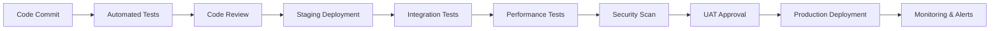

# Design Document

## Overview

This design transforms the existing resume tailor backend application into a complete, market-ready product. The current system has a robust Node.js/Express backend with authentication, payment processing, AI-powered resume tailoring, and comprehensive monitoring. The design focuses on production deployment, client-facing elements, business operations integration, and quality assurance to create a sellable product.

The architecture follows a multi-tier approach with cloud infrastructure, professional web presence, integrated business operations, and a polished Chrome extension, all supported by comprehensive monitoring and maintenance capabilities.

## Architecture

### High-Level System Architecture



### Deployment Architecture



## Components and Interfaces

### 1. Production Infrastructure Components

#### Cloud Platform Setup
- **Primary Platform**: AWS (recommended for comprehensive services)
- **Alternative Platforms**: Google Cloud Platform or Microsoft Azure
- **Compute**: EC2 instances with Auto Scaling Groups
- **Database**: RDS PostgreSQL with Multi-AZ deployment
- **Storage**: S3 for file storage and static assets
- **CDN**: CloudFlare for global content delivery
- **Load Balancing**: Application Load Balancer with health checks

#### Domain and SSL Configuration
- **Domain Registration**: Professional domain through Route 53 or external registrar
- **DNS Management**: Route 53 for DNS resolution
- **SSL Certificates**: AWS Certificate Manager for automatic SSL/TLS
- **Security Headers**: Implemented via CloudFlare and application middleware

### 2. Client-Facing Web Components

#### Landing Page System
```javascript
// Landing page structure
const landingPageComponents = {
  header: {
    navigation: ['Home', 'Features', 'Pricing', 'Support'],
    ctaButton: 'Get Started Free'
  },
  hero: {
    headline: 'Tailor Your Resume for Every Job',
    subheadline: 'AI-powered resume customization in seconds',
    demoVideo: 'product-demo.mp4',
    signupForm: 'email-capture'
  },
  features: [
    'AI-Powered Tailoring',
    'Chrome Extension',
    'Multiple Formats',
    'Cover Letter Generation'
  ],
  testimonials: 'customer-reviews',
  pricing: 'subscription-tiers',
  footer: 'legal-links'
};
```

#### Pricing and Subscription System
- **Subscription Tiers**: Basic, Professional, Enterprise
- **Token Packages**: Maintained for pay-per-use model
- **Free Trial**: 3 free generations for new users
- **Billing Integration**: Stripe subscription management
- **Usage Dashboard**: Real-time usage tracking

### 3. Chrome Extension Enhancement

#### Extension Architecture
```javascript
// Extension manifest structure
const extensionManifest = {
  manifest_version: 3,
  name: "Resume Tailor Pro",
  version: "2.0.0",
  permissions: [
    "activeTab",
    "storage",
    "identity"
  ],
  host_permissions: [
    "https://your-domain.com/*"
  ],
  background: {
    service_worker: "background.js"
  },
  content_scripts: [{
    matches: ["*://*.linkedin.com/*", "*://*.indeed.com/*"],
    js: ["content.js"]
  }],
  action: {
    default_popup: "popup.html"
  }
};
```

#### Extension Features
- **Professional UI/UX**: Modern design with brand consistency
- **Job Site Integration**: Auto-detect job postings on major sites
- **One-Click Tailoring**: Streamlined user experience
- **Offline Capability**: Cache recent generations
- **Error Handling**: Graceful degradation and user feedback

### 4. Business Operations Integration

#### Customer Support System
- **Help Desk Platform**: Zendesk or Intercom integration
- **Knowledge Base**: Self-service documentation
- **Live Chat**: Real-time customer support
- **Ticket Management**: Automated routing and escalation
- **Customer Feedback**: Integrated feedback collection

#### Email Marketing and Communication
```javascript
// Email service configuration
const emailConfig = {
  provider: 'SendGrid',
  templates: {
    welcome: 'welcome-series',
    onboarding: 'feature-introduction',
    usage: 'monthly-summary',
    billing: 'payment-notifications',
    support: 'ticket-updates'
  },
  automation: {
    drip_campaigns: true,
    behavioral_triggers: true,
    segmentation: 'usage-based'
  }
};
```

#### Analytics and Tracking
- **User Analytics**: Google Analytics 4 with enhanced ecommerce
- **Conversion Tracking**: Funnel analysis and optimization
- **Usage Metrics**: Feature adoption and engagement
- **Performance Monitoring**: Application performance insights
- **Business Intelligence**: Revenue and growth metrics

## Data Models

### Enhanced User Model
```javascript
const UserSchema = {
  id: 'UUID PRIMARY KEY',
  email: 'VARCHAR(255) UNIQUE NOT NULL',
  password_hash: 'VARCHAR(255) NOT NULL',
  tokens: 'INTEGER DEFAULT 3', // Free trial tokens
  subscription_tier: 'VARCHAR(50) DEFAULT "free"',
  subscription_status: 'VARCHAR(50) DEFAULT "active"',
  subscription_id: 'VARCHAR(255)', // Stripe subscription ID
  trial_ends_at: 'TIMESTAMP',
  created_at: 'TIMESTAMP DEFAULT NOW()',
  updated_at: 'TIMESTAMP DEFAULT NOW()',
  last_login: 'TIMESTAMP',
  profile: {
    first_name: 'VARCHAR(100)',
    last_name: 'VARCHAR(100)',
    company: 'VARCHAR(255)',
    job_title: 'VARCHAR(255)'
  },
  preferences: {
    email_notifications: 'BOOLEAN DEFAULT true',
    marketing_emails: 'BOOLEAN DEFAULT false',
    theme: 'VARCHAR(20) DEFAULT "light"'
  },
  usage_stats: {
    total_generations: 'INTEGER DEFAULT 0',
    last_generation: 'TIMESTAMP',
    favorite_formats: 'JSON'
  }
};
```

### Subscription Management Model
```javascript
const SubscriptionSchema = {
  id: 'UUID PRIMARY KEY',
  user_id: 'UUID REFERENCES users(id)',
  stripe_subscription_id: 'VARCHAR(255) UNIQUE',
  tier: 'VARCHAR(50) NOT NULL', // basic, professional, enterprise
  status: 'VARCHAR(50) NOT NULL', // active, canceled, past_due
  current_period_start: 'TIMESTAMP',
  current_period_end: 'TIMESTAMP',
  cancel_at_period_end: 'BOOLEAN DEFAULT false',
  monthly_generations: 'INTEGER',
  used_generations: 'INTEGER DEFAULT 0',
  created_at: 'TIMESTAMP DEFAULT NOW()',
  updated_at: 'TIMESTAMP DEFAULT NOW()'
};
```

### Analytics and Metrics Model
```javascript
const AnalyticsSchema = {
  user_events: {
    id: 'UUID PRIMARY KEY',
    user_id: 'UUID REFERENCES users(id)',
    event_type: 'VARCHAR(100)', // signup, login, generation, upgrade
    event_data: 'JSON',
    timestamp: 'TIMESTAMP DEFAULT NOW()',
    session_id: 'VARCHAR(255)'
  },
  business_metrics: {
    date: 'DATE PRIMARY KEY',
    new_signups: 'INTEGER DEFAULT 0',
    active_users: 'INTEGER DEFAULT 0',
    total_generations: 'INTEGER DEFAULT 0',
    revenue: 'DECIMAL(10,2) DEFAULT 0',
    churn_rate: 'DECIMAL(5,4) DEFAULT 0'
  }
};
```

## Error Handling

### Production Error Management
```javascript
const ErrorHandlingStrategy = {
  client_errors: {
    validation: 'Return structured error messages',
    authentication: 'Redirect to login with context',
    authorization: 'Show upgrade prompts for premium features',
    rate_limiting: 'Display usage limits and upgrade options'
  },
  server_errors: {
    ai_service: 'Fallback to cached responses or queue for retry',
    database: 'Circuit breaker pattern with graceful degradation',
    payment: 'Retry logic with exponential backoff',
    file_processing: 'Alternative processing methods'
  },
  monitoring: {
    error_tracking: 'Sentry or Rollbar integration',
    alerting: 'PagerDuty for critical issues',
    logging: 'Structured logging with correlation IDs',
    metrics: 'Custom dashboards for business KPIs'
  }
};
```

### User Experience Error Handling
- **Graceful Degradation**: Core functionality remains available during partial outages
- **User-Friendly Messages**: Clear, actionable error messages
- **Retry Mechanisms**: Automatic retry for transient failures
- **Offline Support**: Chrome extension works with cached data
- **Progress Indicators**: Clear feedback during long operations

## Testing Strategy

### Comprehensive Testing Approach

#### 1. Automated Testing Pipeline
```javascript
const TestingStrategy = {
  unit_tests: {
    coverage_target: '90%',
    frameworks: ['Jest', 'Supertest'],
    focus: ['Business logic', 'API endpoints', 'Data validation']
  },
  integration_tests: {
    database: 'Test with real PostgreSQL instance',
    external_apis: 'Mock Stripe, Gemini, and email services',
    file_processing: 'Test with various document formats'
  },
  end_to_end_tests: {
    framework: 'Playwright or Cypress',
    scenarios: [
      'User registration and onboarding',
      'Resume generation workflow',
      'Payment and subscription management',
      'Chrome extension integration'
    ]
  }
};
```

#### 2. Performance Testing
- **Load Testing**: Simulate concurrent users with Artillery or k6
- **Stress Testing**: Identify breaking points and bottlenecks
- **Database Performance**: Query optimization and indexing
- **API Response Times**: Target <200ms for critical endpoints
- **File Processing**: Optimize document parsing and generation

#### 3. Security Testing
- **Penetration Testing**: Professional security audit
- **Vulnerability Scanning**: Automated security scanning
- **Authentication Testing**: JWT security and session management
- **Data Protection**: GDPR compliance and data encryption
- **Input Validation**: SQL injection and XSS prevention

#### 4. User Acceptance Testing
- **Beta Testing Program**: Recruit existing users for testing
- **Usability Testing**: Professional UX evaluation
- **A/B Testing**: Optimize conversion rates and user experience
- **Accessibility Testing**: WCAG compliance verification
- **Cross-Browser Testing**: Chrome extension compatibility

### Quality Assurance Process


## Implementation Phases

### Phase 1: Infrastructure and Security (Week 1-2)
- Set up cloud infrastructure and CI/CD pipeline
- Configure domain, SSL, and security measures
- Implement monitoring and logging systems
- Set up staging and production environments

### Phase 2: Client-Facing Elements (Week 3-4)
- Develop professional landing page and marketing site
- Create pricing pages and subscription management
- Implement user onboarding and documentation
- Set up customer support systems

### Phase 3: Chrome Extension Enhancement (Week 5-6)
- Redesign extension UI with professional branding
- Implement advanced job site integration
- Add offline capabilities and error handling
- Prepare Chrome Web Store submission

### Phase 4: Business Operations (Week 7-8)
- Integrate email marketing and automation
- Set up analytics and conversion tracking
- Implement customer support workflows
- Configure billing and subscription management

### Phase 5: Testing and Launch (Week 9-10)
- Comprehensive testing across all components
- User acceptance testing and feedback integration
- Security audit and performance optimization
- Soft launch with beta users and full launch preparation

## Monitoring and Maintenance

### Production Monitoring Stack
```javascript
const MonitoringConfig = {
  application_monitoring: {
    apm: 'New Relic or DataDog',
    error_tracking: 'Sentry',
    logging: 'CloudWatch Logs',
    metrics: 'Custom dashboards'
  },
  infrastructure_monitoring: {
    servers: 'CloudWatch',
    database: 'RDS Performance Insights',
    cdn: 'CloudFlare Analytics',
    uptime: 'Pingdom or UptimeRobot'
  },
  business_monitoring: {
    revenue: 'Stripe Dashboard + custom analytics',
    user_engagement: 'Google Analytics + Mixpanel',
    support_metrics: 'Zendesk reporting',
    conversion_rates: 'Custom funnel analysis'
  }
};
```

### Maintenance Procedures
- **Automated Backups**: Daily database backups with point-in-time recovery
- **Security Updates**: Automated dependency updates and security patches
- **Performance Optimization**: Regular performance reviews and optimizations
- **Capacity Planning**: Proactive scaling based on usage trends
- **Disaster Recovery**: Documented procedures and regular testing

This design provides a comprehensive roadmap for transforming the existing backend into a complete, market-ready product with professional infrastructure, client-facing elements, and business operations integration.